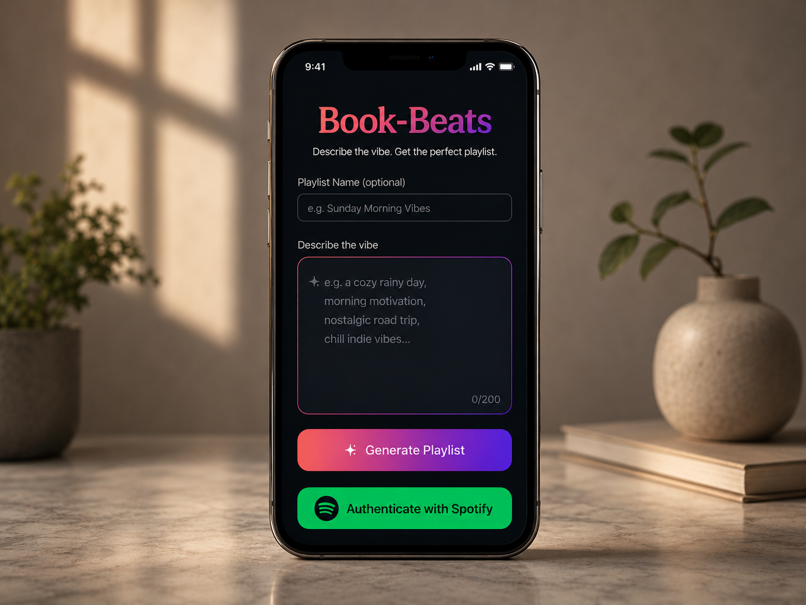
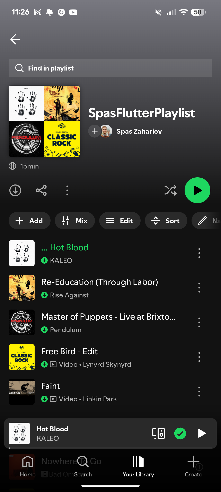

# 📖🎵 Book Beats — AI-Powered Spotify Playlist Generator

[](https://flutter.dev)
[](https://dart.dev)
[](https://developer.android.com)

A mobile app that turns your vibe, mood, or description into a **real Spotify playlist** — created directly in your account with AI-curated tracks.

## Screenshots

<div align="center">
  <table>
    <tr>
      <td align="center">
        
        <br/><em>Main screen — describe your vibe</em>
      </td>
    </tr>
    <tr>
      <td align="center">
        
        <br/><em>Your AI-generated playlist in Spotify</em>
      </td>
    </tr>
  </table>
</div>

## How It Works

1. **Describe your vibe** — type a mood, genre blend, activity, or any description into the text field
2. **Tap "Generate Playlist"** — the app sends your description to an AI service
3. **Get your playlist** — a new playlist is created in your Spotify account with tracks that match your vibe

## Features

- **AI-Powered Curation** — natural language input translated into music selection
- **Spotify Integration** — OAuth 2.0 authentication with secure token storage
- **Real Playlist Creation** — generated playlists appear directly in your Spotify library
- **Cross-Platform** — single Dart/Flutter codebase targeting Android

## Tech Stack & Skills Demonstrated

| Area | Technology |
|---|---|
| **Framework** | Flutter 3.24+ / Dart 3.5+ |
| **UI** | Material Design, responsive widgets |
| **Authentication** | OAuth 2.0 (Spotify API), `oauth2_client` |
| **Security** | Secure credential storage (`flutter_secure_storage`) |
| **API Integration** | REST — Spotify Web API + AI backend |
| **Configuration** | Environment variables via `flutter_dotenv` |
| **State Management** | Custom state handling with progress & success flows |

### What This Project Shows

- ✅ Third-party API integration (Spotify OAuth + Web API)
- ✅ Secure authentication and token management on mobile
- ✅ RESTful API communication and async/await patterns
- ✅ Clean UI/UX with proper loading states, error handling, and success feedback
- ✅ Cross-platform development with a single codebase

## Getting Started

### Prerequisites

- [Flutter SDK](https://flutter.dev/docs/get-started/install) (3.24+)
- An Android emulator or physical device
- A [Spotify Developer Account](https://developer.spotify.com/dashboard/) with a registered app
- A backend AI service endpoint for playlist generation

### Setup

```bash
# Clone the repository
git clone <repo-url>
cd book-beats-mobile

# Install dependencies
flutter pub get

# Configure environment variables
cp .env.example .env
# Edit .env with your Spotify client ID, redirect URI, and AI backend URL

# Run the app
flutter run
```

## Project Structure

```
lib/
├── main.dart                 # App entry point & UI scaffolding
├── do_everything_command.dart # Business logic: playlist generation flow
├── prompts.dart              # Prompt templates for AI requests
├── ProggressState.dart       # Loading/progress state widget
└── success_banner.dart        # Success feedback UI component
```

## Built With

- **Flutter** — UI framework
- **Spotify Web API** — playlist creation & track management
- **oauth2_client** — OAuth 2.0 authorization flow
- **flutter_secure_storage** — encrypted storage for auth tokens
- **flutter_dotenv** — environment configuration management

## License

This project is open source and available under the [MIT License](LICENSE).
